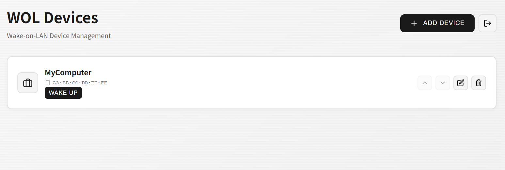

## Lightweight WOL WebUI
a simple windows web ui for Wake-on-LAN

### Features
- Written in Rust for minimal memory usage
- JWT-based authentication: Login session maintains with periodic connections
- Runs web service in tray without console
- Simple user interface

### Execution
Extract the uploaded zip file from releases and run the exe.
default port is 25533(http://localhost:25533).

### Configuration
Port number can be modified in the configuration file (Rocket.toml) if needed.

### Caution
This program is designed to be used through a reverse-proxy when accessed from outside.  
Using this program exposed externally without TLS could result in password exposure.

